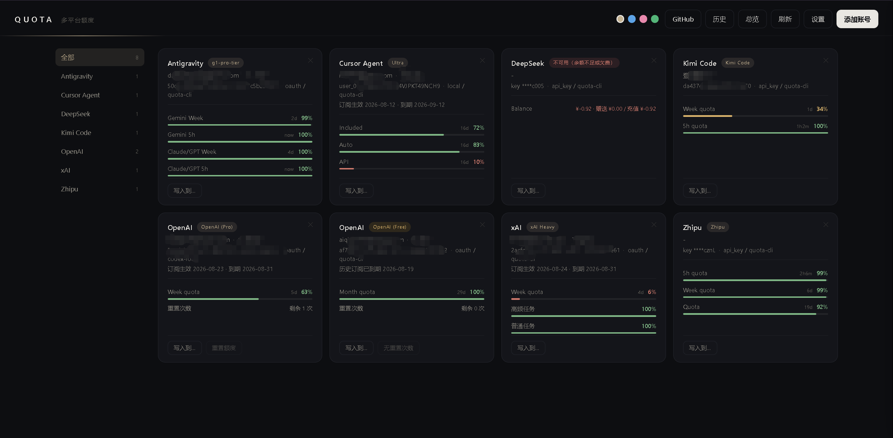
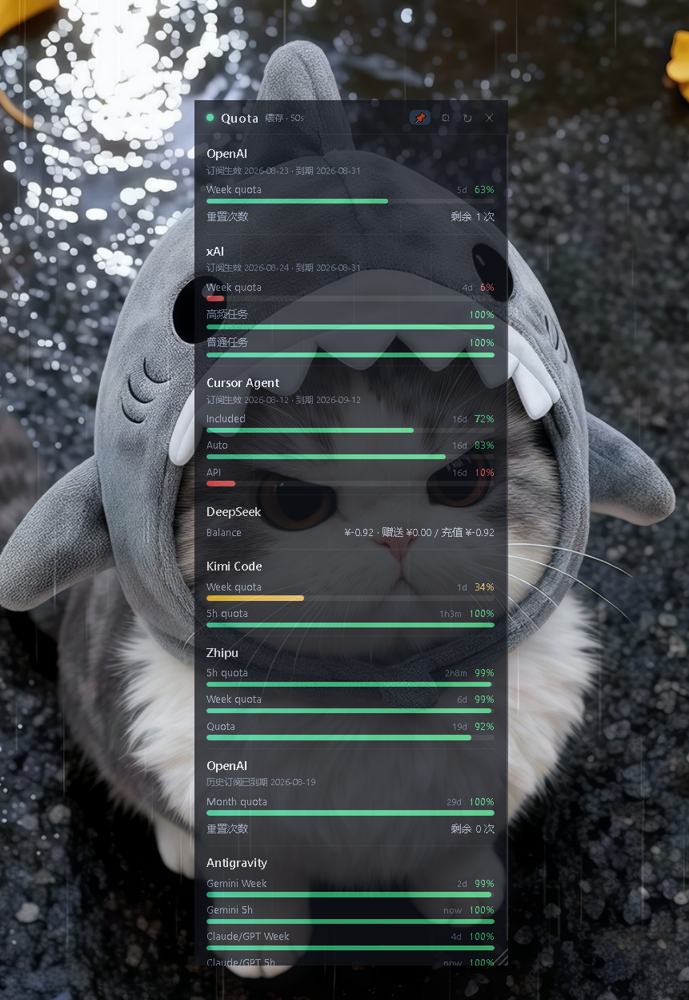

<p align="center">
  
</p>

<h1 align="center">Quota CLI</h1>

<p align="center">
  在 Web 和 Windows 桌面悬浮窗里，统一查看多个 AI Provider 的账号额度，并按需写入 IDE 与 Agent Harness。
</p>

<p align="center">
  
  
  <a href="LICENSE"></a>
</p>

<p align="center">
  
</p>

Quota CLI 是一个本地优先的 AI 账号额度聚合工具。它会发现本机已有登录态和手动添加的 API Key，并行查询各平台的额度、套餐、重置时间与订阅周期，再把结果放进一份共享快照中。

你可以把它理解成两部分：

- **额度看板**：Web 与悬浮窗双端共用同一份结果，不必来回打开多个客户端；终端只作为启动菜单与管理命令入口。
- **凭证分发器**：从本地账号库选择一个账号，写入 OpenCode、OMP、Codex、Claude Code、Cursor 等目标。

> 当前仓库实现了 9 类 Provider 和 10 个写入目标。平台接口可能调整；“代码已支持”不代表所有账号类型都经过真实网络环境验证。

## 核心能力

- **双端看板**：Web 适合完整管理，Windows 悬浮窗适合桌面常驻，还支持自定义背景图；终端运行 `quota` 只是两者的启动菜单。
- **自动发现**：读取 Codex、OpenCode、Cockpit、Grok CLI、Claude Code、Cursor 等本机登录态，也支持环境变量、JSON 和手动添加。
- **共享快照**：Web 与悬浮窗共用 `~/.quota-cli/quota-snapshot.json`，跨进程锁会合并同一刷新周期的请求。
- **令牌保鲜**：账号带有 refresh token 时，会在过期前或遇到 `401` 后尝试刷新，并同步回支持的来源。
- **写入目标**：覆盖前先确认；多数文件或数据库目标会生成 `.quota-bak` 备份，并在本地记录写入历史。
- **轻量实现**：Python 3.10+、原生 HTML/CSS/JS，没有 Node、React、Tauri 或 Electron 构建链。

## 界面：Web 与悬浮窗

| 入口 | 启动方式 | 适合场景 | 主要能力 | 平台边界 |
| --- | --- | --- | --- | --- |
| 悬浮窗 | `quota` 或 `quota float` | 桌面常驻、随时扫一眼 | 置顶、拖动、缩放、透明度、自定义背景图（cover 自适应任意窗口尺寸）、5 款配色主题、托盘、手动刷新、展示项选择；**内嵌 Web 服务** | 完整体验以 Windows 为准 |
| Web | `quota ui`，或点悬浮窗标题栏 🌐 | 账号与额度的完整管理 | Provider 筛选、四款主题、添加账号、OAuth、历史恢复、写入 Harness、OpenAI 重置额度、运行日志查看 | 默认仅 `127.0.0.1:18765` |

Web 服务内嵌在悬浮窗进程里：关闭悬浮窗，Web UI 与 API 随之停止，没有任何后台残留。无显示器的 headless 服务器可运行 `quota ui-run` 单独启动 Web 服务。

两个界面连接的是同一份本地额度快照：一个界面完成刷新后，另一个界面会复用结果，避免同一周期重复请求 Provider。

<p align="center">
  
</p>

## 支持的 Provider

表里的“查询凭据”是当前额度接口真正需要的认证，不等同于所有可导入或可保存的凭证类型。

| Provider | Provider ID | 可查看内容 | 查询凭据 | 可写目标 |
| --- | --- | --- | --- | --- |
| Grok / xAI | `grok` | 周额度、高频/普通任务、套餐、订阅周期 | Grok OAuth | OpenCode、OMP、Grok CLI |
| OpenAI / ChatGPT / Codex | `openai` | 5h/周/月窗口、消费额度、重置次数、套餐、订阅周期 | ChatGPT / Codex OAuth | OpenCode（OAuth）、OMP（OAuth 或 Platform API Key）、Codex CLI / App（OAuth） |
| Claude Code | `claude` | 5h、周、7d OAuth 用量窗口 | Claude OAuth | OpenCode、OMP、Claude Code |
| Zhipu / Z.ai | `zai` | 5h、周、通用额度窗口 | API Key | OpenCode、OMP、GLM → Claude Code |
| Kimi Code | `kimi` | 周额度与服务端返回的动态限制窗口 | API Key | OpenCode、OMP、Kimi Code CLI |
| DeepSeek | `deepseek` | CNY/USD 总余额、赠送余额、充值余额、可用状态 | API Key | OpenCode、OMP |
| Antigravity | `antigravity` | Gemini 与 Claude/GPT 的周/5h 窗口、套餐 | Google OAuth | Antigravity IDE |
| Cursor | `cursor` | Total、Auto + Composer、API 等用量与套餐 | Cursor IDE session | Cursor IDE |
| Cursor Agent | `cursor_agent` | Included、Auto、API、套餐与计费周期 | `crsr_` API Key 或本机登录 | OMP、Cursor Agent |

> **“可导入”不等于“可查询”。** OpenAI Platform API Key、普通 Anthropic API Key 和 xAI API Key 可以进入本地凭证库或用于部分写入目标，但当前 ChatGPT、Claude Code、Grok 的额度查询仍依赖对应产品的 OAuth / 登录态。

Cursor 的两类凭证也不能混用：`cursor` 使用 IDE session，`cursor_agent` 使用 `crsr_` Key 换取短期令牌。

## 写入 IDE 与 Agent Harness

这里的 Harness 指 OpenCode、OMP、各官方 CLI / IDE 等认证目标。Quota CLI 不负责安装这些软件，只负责在目标已经存在时写入兼容的凭证。

先在 Web UI 或悬浮窗里完成一次刷新以收集账号（写入 agent.db），再运行 `quota ui`，在账号卡片点击“写入到…”。

当前没有 `quota provision` 或 `quota sync` 直达子命令。写入前会刷新可续期令牌；发现已有登录态时会要求确认。建议先退出目标 IDE / CLI，写入后再重新打开。

| 目标 | 可写入的 Provider / 凭证 | 配置位置 | 前置条件与限制 |
| --- | --- | --- | --- |
| OpenCode | Grok OAuth、OpenAI OAuth、Claude OAuth、Kimi、Zhipu / Z.ai、DeepSeek | `~/.local/share/opencode/auth.json` | 可创建文件；同名条目需确认覆盖 |
| OMP | Grok、OpenAI OAuth / Platform API Key、Claude、Cursor Agent、Kimi、Zhipu / Z.ai、DeepSeek | `~/.omp/agent/agent.db` | OMP 数据库必须已存在 |
| Grok CLI | Grok OAuth | `~/.grok/auth.json` | 账号必须包含 access token |
| Cursor Agent | Cursor Agent `crsr_` Key / 登录票 | Windows：`%APPDATA%\Cursor\auth.json` | 当前写入路径仅实现 Windows |
| Codex CLI / App | OpenAI / Codex OAuth | `~/.codex/auth.json` | 必须包含 access + refresh token；CLI 与 App 共用 |
| Claude Code | Claude OAuth | `~/.claude/.credentials.json` | 必须包含 access + refresh token |
| Kimi Code CLI | Kimi API Key | `~/.kimi-code/config.toml` | 文件及 `managed:kimi-code` 段必须已存在 |
| GLM → Claude Code | Zhipu / Z.ai API Key | `~/.claude/settings.json` | 写入 Anthropic 兼容地址与令牌 |
| Antigravity IDE | Antigravity Google OAuth | IDE 的 `globalStorage/state.vscdb` | 先在 IDE 登录一次；写入后重启 IDE |
| Cursor IDE | Cursor session | IDE 的 `globalStorage/state.vscdb` | 只接受 IDE session，不接受 Cursor Agent 的 `crsr_` Key |

> 多数文件或数据库目标会在覆盖前生成 `.quota-bak`，但 Cursor IDE 当前不会自动备份。写入登录态属于敏感操作，请先确认目标账号和覆盖提示。

## 快速安装

要求：

- Python 3.10+
- Git
- Windows 使用悬浮窗时，需要系统可用的 Edge WebView2

### Windows

```powershell
git clone https://github.com/dushanaicode/quota-cli.git
cd quota-cli
.\install.cmd

# 新开终端后验证
quota ui
```

`install.cmd` 会在仓库内创建 `.venv`、安装依赖，并把仓库目录加入当前用户的 `PATH`。

### macOS / Linux

```bash
git clone https://github.com/dushanaicode/quota-cli.git
cd quota-cli
sh install.sh

# 新开终端后验证
quota ui
```

`install.sh` 会使用当前 `python3` / `python` 安装依赖，在 `~/.local/bin/quota` 创建启动脚本，并尝试把该目录加入 shell profile。启动脚本会指向当前仓库，所以安装后不要随意移动或删除仓库目录。

如果系统 Python 不允许直接安装依赖，可以使用虚拟环境运行：

```bash
python3 -m venv .venv
. .venv/bin/activate
python -m pip install -r requirements.txt
python quota.py ui
```

<details>
<summary>让本机 Agent 帮你安装</summary>

把下面内容交给本机 Agent：

```text
请安装并验证 Quota CLI：

1. 仓库：https://github.com/dushanaicode/quota-cli
2. 确认 Python 3.10+ 可用。
3. 克隆仓库并进入根目录。
4. Windows 运行 install.cmd；macOS/Linux 运行 sh install.sh。
5. 新开终端，执行 quota ui。
6. 不要修改其他工具源码，不要在回复中输出任何密钥。

完成后只报告 quota 命令的实际路径和验证命令的退出码。
```

</details>

## 常用命令

| 命令 | 用途 |
| --- | --- |
| `quota` | 启动悬浮窗（内嵌 Web 服务，关闭即全停） |
| `quota ui` | 打开本机 Web UI（服务未运行时会先拉起悬浮窗） |
| `quota float` | 启动桌面悬浮窗 |
| `quota add` | 交互式添加账号 |
| `quota add <provider> --key <API_KEY>` | 添加 API Key |
| `quota add <provider> --json <FILE>` | 从 JSON 导入 |
| `quota add <provider> --env` | 从对应环境变量导入 |
| `quota add <provider> --local` | 从本机已登录客户端导入 |
| `quota accounts` | 查看本地账号库 |
| `quota rules` | 查看各 Provider 的认证入口 |
| `quota config` | 查看配置、数据路径与环境变量状态 |
| `quota env <NAME> <VALUE>` | 把受支持的变量保存到本地配置 |
| `quota remove <ACCOUNT_ID>` | 删除 quota-cli 本地账号 |

命令行中的 Key 可能进入 shell 历史。添加敏感凭证时，更建议使用 `quota add` 交互输入或 `quota ui`。

## 工作方式

1. **发现账号**：从本机客户端、环境变量和 quota-cli 本地库收集账号，按身份与 Key 去重。
2. **并行查询**：按 Provider 调用对应额度接口，最多使用 8 个工作线程。
3. **共享结果**：结果写入不含密钥的共享快照，Web 与悬浮窗共同读取。
4. **凭证保鲜**：有 refresh token 的 OAuth 账号会在需要时刷新，并尽可能回写来源。
5. **按需分发**：用户确认后，把选中的账号写入兼容 IDE / Harness，并记录历史。

## 本地数据与安全边界

默认数据目录是 `~/.quota-cli/`；可以用 `QUOTA_CLI_HOME` 改到其他位置。

| 文件 | 用途 | 是否包含完整凭证 |
| --- | --- | --- |
| `config.json` | 刷新间隔、界面状态、通过 `quota env` 保存的配置 | 可能包含环境变量值 |
| `accounts.json` | 手动添加或 OAuth 保存的账号 | 是 |
| `agent.db` | 聚合账号、access/refresh token、API Key、套餐、订阅和写入历史 | 是 |
| `quota-snapshot.json` | Web 与悬浮窗共用的展示快照 | 否 |
| `quota.log` | 运行日志（JSONL，Web UI「日志」面板可查看） | 否 |
| `quota-snapshot.lock` | 跨进程刷新锁 | 否 |

- 项目没有遥测，也没有自建凭证中转服务；查询额度时会从本机直接请求对应 Provider API。
- `accounts.json` 和 `agent.db` 保存的是可用的完整凭证，不是系统钥匙串。请像保护 SSH Key 一样保护 `~/.quota-cli/`，不要同步到网盘或提交到 Git。
- `quota ui` 默认只绑定 `127.0.0.1:18765`。Web 后端没有登录认证和 TLS，**不要直接暴露到局域网或公网**。
- 界面只展示脱敏后的 Key；共享快照不会写入 access token、refresh token 或 API Key。
- OpenAI“重置额度”会消耗一次 reset credit，只有在界面明确确认且服务端状态完整时才会执行。

## 部署、升级与开发

Quota CLI 当前采用“克隆源码到长期保留目录后安装”的本机部署方式，不是公网服务，也不是容器化应用。

仓库当前没有提供：

- PyPI 包或 `pip install quota-cli`
- Dockerfile / Docker Compose
- 独立 EXE、DMG、AppImage
- Homebrew、Winget 等安装包
- Nginx、公网鉴权或 TLS 配置

因此，不要把 Web UI 直接部署成公开服务。服务器场景用 `quota ui-run` 在本机起服务，再用 SSH 端口转发访问（`ssh -L 18765:127.0.0.1:18765`），凭证与数据仍放在运行用户自己的数据目录中。

升级代码：

```text
git pull

# Windows
.\install.cmd

# macOS / Linux
sh install.sh
```

本地开发与验证：

```text
python -m venv .venv

# Windows
.\.venv\Scripts\python -m pip install -r requirements.txt
.\.venv\Scripts\python quota.py --help
.\.venv\Scripts\python -m unittest discover -s tests -v

# macOS / Linux
./.venv/bin/python -m pip install -r requirements.txt
./.venv/bin/python quota.py --help
./.venv/bin/python -m unittest discover -s tests -v
```

Web 前端位于 `web/index.html`，悬浮窗页面位于 `web/float.html`，均为原生 HTML/CSS/JS，不需要前端构建步骤。

## Agent Skill

仓库附带 [`skills/quota-cli/SKILL.md`](skills/quota-cli/SKILL.md)。安装脚本会把它复制到 OpenCode 的 `~/.config/opencode/skills/quota-cli/`；其他 Agent 可以按各自的 Skill 目录规则导入。

Agent 查询额度时建议走本机 Web API（先 `quota ui` 确保服务已启动；服务由悬浮窗进程内嵌提供）：

```bash
curl http://127.0.0.1:18765/api/quota
```

只有用户明确要求立即联网时，才使用 `http://127.0.0.1:18765/api/quota?force=1`；不要在日志或回复中输出完整凭证。运行日志可通过 `curl http://127.0.0.1:18765/api/logs` 读取。

## License

[MIT](LICENSE)
