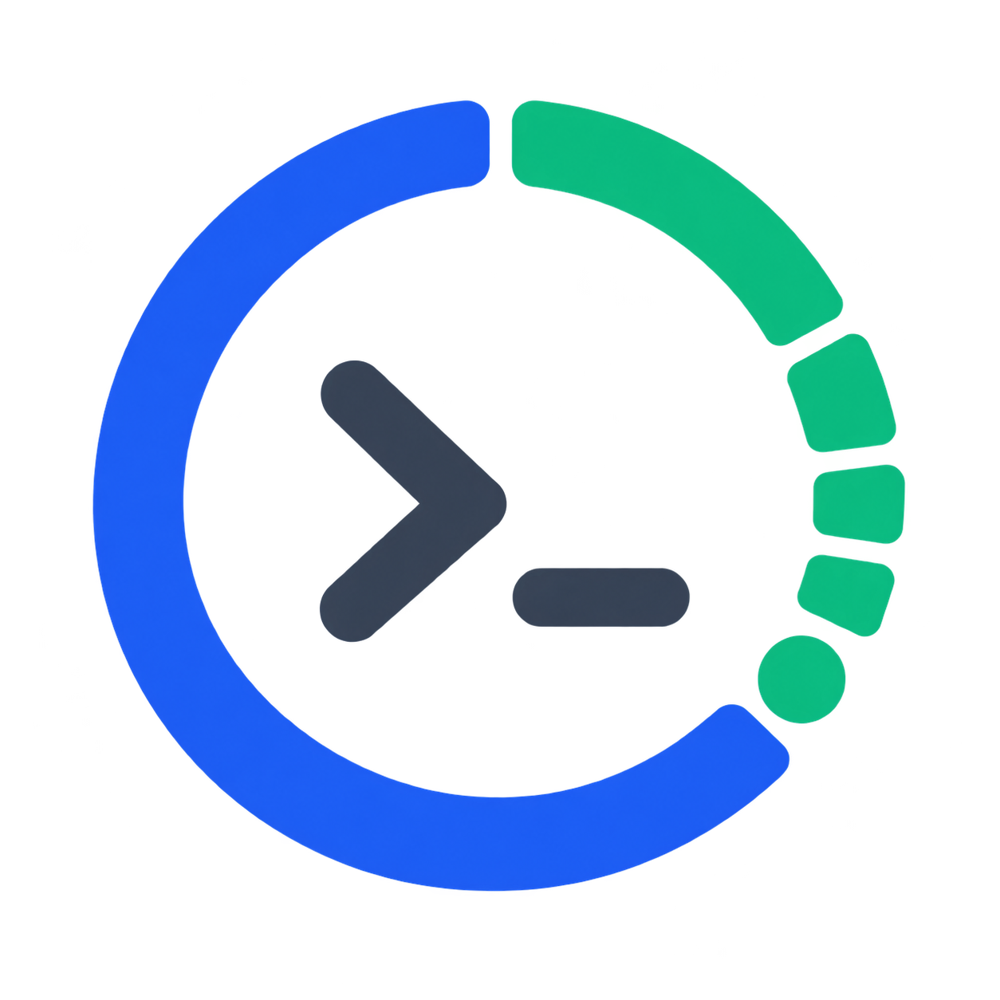

<p align="center">
  
</p>

<h1 align="center">Dushan Quota</h1>

<p align="center">
  在 Web 和 Windows 桌面悬浮窗里，统一查看多个 AI Provider 的账号额度，并按需写入 IDE 与 Agent Harness。
</p>

<p align="center">
  
  
  
  <a href="LICENSE"></a>
</p>

<p align="center">
  
</p>

Dushan Quota 是一个本地优先的 AI 账号额度与 Token 用量看板。它会发现本机已有登录账号和手动添加的 API Key，把各平台的额度、套餐、重置时间、本机客户端用量与远端账号用量放到一起，同时明确区分账号和 Harness，避免把一台机器的总量重复算到多个账号。

## v0.2.0：账号级用量看板

- **按账号归属**：同一个 `(Provider, Harness)` 只显示一个当前激活账号；Codex、OpenCode、OMP 可以同时激活不同的 OpenAI 账号。
- **按时间查看**：本机 Token 支持近 1 天、7 天、30 天与累计；远端数据按 Provider 实际提供的统计周期展示。
- **按 Harness 筛选**：Codex、OpenCode、OMP、Kimi Code CLI、Claude Code、Grok CLI 可以单独查看，也可以汇总。
- **按模型拆分**：展示总 Token、输入、输出、缓存读取、缓存写入和推理 Token；来源没有某项时不伪造数据。
- **激活健康状态**：区分“已激活”“不可续期”“已激活但过期”“已激活但失效”和“已激活但受限”，悬停可查看有效期与写入时间。
- **本机与远端分离**：远端账号统计无法可靠归属到某个 Harness，因此不会与本机用量强行相加。

### Token 数据源

| Provider | 远端 Token | 本机 Token | 账号归属方式 |
| --- | --- | --- | --- |
| OpenAI / ChatGPT / Codex | 今日、7 天、30 天、累计 | Codex、OpenCode、OMP | 远端按账号；Codex/OpenCode 按激活时间线；OMP 优先使用 `credential_pin` |
| Grok / xAI | 当前版本仅查询额度窗口；API Team 历史用量需要 Management Key | Grok CLI、OpenCode、OMP | 当前凭据或激活时间线 |
| Claude | Anthropic Admin Key 可查询 1/7/30 天模型 Token | Claude Code、OpenCode、OMP | 当前凭据或激活时间线 |
| Kimi Code | 服务端周/5h 百分比仅作为额度，不伪装成 Token | Kimi Code CLI、OpenCode、OMP | 当前 Kimi 凭据；多账号时使用激活时间线 |
| Zhipu / Z.ai | 近 30 天模型 Token | OpenCode、OMP | API Key 与激活时间线 |
| DeepSeek | 官方 API 暂无历史用量查询 | OpenCode、OMP | API Key 与激活时间线 |
| Antigravity / Cursor | 暂无可靠 Token 历史接口 | 暂未统计 Token | 继续展示官方额度和计数窗口 |

本机累计表示“当前设备仍保留的日志累计”，不等于 Provider 服务端的账号终身累计。无法确认账号归属的历史日志不会强行分配。

## 快速安装

Windows 推荐使用经过验证的 pipx 1.8.0，并固定它的共享 pip 版本：

```powershell
py -m pip install --user "pipx==1.8.0"
py -m pipx ensurepath --prepend
```

重新打开终端后，安装并启动：

```powershell
pipx install --index-url https://pypi.org/simple --pip-args="pip==25.2" dushan-quota
quota
```

`quota` 会先显示当前版本和 GitHub 地址，再检查最新 Release。发现新版本时，可以查看升级命令、本次跳过，或者永久跳过这个版本；以后出现更高版本仍会提醒。

升级也使用同一份稳定约束：

```powershell
pipx upgrade --index-url https://pypi.org/simple --pip-args="pip==25.2" dushan-quota
quota --version
```

<details>
<summary>让本机 Agent 帮你安装</summary>

把下面这段交给本机 Agent：

```text
请用 pipx 安装并验证 Dushan Quota：

1. 执行 py -m pip install --user "pipx==1.8.0"。
2. 执行 py -m pipx ensurepath --prepend，并按提示重新打开终端。
3. 执行 pipx install，并通过 --pip-args="pip==25.2" 固定共享 pip。
4. 执行 quota config，确认命令和数据目录正常。
5. 执行 quota ui，确认页面可以打开。
6. 不要输出任何 Key、Token 或账号凭证。

完成后告诉我 quota 的实际路径和验证结果。
```

</details>

简单说，它主要干两件事：

- **额度看板**：Web 与悬浮窗双端共用同一份结果，不必来回打开多个客户端；终端只负责启动和管理命令。
- **凭证分发器**：从本地账号库选择一个账号，写入 OpenCode、OMP、Codex、Claude Code、Cursor 等目标。

> 目前接了 9 类 Provider 和 10 个写入目标。平台接口偶尔会变，如果碰到某个账号查不到，欢迎提 Issue。

## 核心能力

- **双端看板**：Web 适合完整管理，悬浮窗适合放在桌面上随时看一眼；运行 `quota` 就能打开。
- **背景随你换**：自带一张默认背景，也可以换成自己喜欢的图片；窗口怎么缩放，图片都会自动铺满。
- **自动发现**：读取 Codex、OpenCode、Cockpit、Grok CLI、Claude Code、Cursor 等本机登录态，也支持环境变量、JSON 和手动添加。
- **用量智能**：按账号、模型、时间与 Harness 汇总本机/远端 Token，支持详细输入、输出、缓存和推理拆分。
- **激活状态**：读取目标 Harness 的当前凭据，展示激活账号、写入时间、有效期、过期、失效、受限与不可续期状态。
- **共享快照**：Web 与悬浮窗共用 `~/.dushan-quota/quota-snapshot.json`，跨进程锁会合并同一刷新周期的请求。
- **更新检查**：运行 `quota` 会检查 GitHub Release，Web 顶栏也能手动检查；升级仍由你确认，不会悄悄改动环境。
- **令牌保鲜**：账号带有 refresh token 时，会在过期前或遇到 `401` 后尝试刷新，并同步回支持的来源。
- **写入目标**：覆盖前先确认；多数文件或数据库目标会生成 `.quota-bak` 备份，并在本地记录写入历史。
- **轻量实现**：Python 3.10+、原生 HTML/CSS/JS，没有 Node、React、Tauri 或 Electron 构建链。

## 界面：Web 与悬浮窗

| 入口 | 启动方式 | 适合场景 | 主要能力 | 平台边界 |
| --- | --- | --- | --- | --- |
| 悬浮窗 | `quota` 或 `quota float` | 桌面常驻、随时扫一眼 | 额度、Token 用量、1/7/30 天/累计、Harness 筛选、置顶、透明度、背景与主题；**内嵌 Web 服务** | Windows 全功能；macOS 已实现拖动/缩放/置顶/透明度/透明圆角（未经实机验证） |
| Web | `quota ui`，或点悬浮窗标题栏 🌐 | 账号、额度与用量的完整管理 | Provider/账号/模型/Harness 用量详情、激活健康状态、添加账号、OAuth、历史恢复、凭据写入、OpenAI 重置额度、日志 | 默认仅 `127.0.0.1:18765` |

Web 服务内嵌在悬浮窗进程里：关闭悬浮窗，Web UI 与 API 随之停止，没有任何后台残留。无显示器的 headless 服务器可运行 `quota ui-run` 单独启动 Web 服务。

两个界面连接的是同一份本地额度快照：一个界面完成刷新后，另一个界面会复用结果，避免同一周期重复请求 Provider。

<p align="center">
  
</p>

## 支持的 Provider

表里的“查询凭据”是当前额度接口真正需要的认证，不等同于所有可导入或可保存的凭证类型。

| Provider | Provider ID | 可查看内容 | 查询凭据 | 可写目标 |
| --- | --- | --- | --- | --- |
| Grok / xAI | `grok` | 周额度、高频/普通任务、套餐、订阅周期 | Grok OAuth | OpenCode、OMP、Grok CLI |
| OpenAI / ChatGPT / Codex | `openai` | 5h/周/月窗口、消费额度、重置次数、套餐、订阅周期 | ChatGPT / Codex OAuth | OpenCode（OAuth）、OMP（OAuth 或 Platform API Key）、Codex CLI / App（OAuth） |
| Claude Code | `claude` | 5h、周、7d OAuth 用量窗口 | Claude OAuth | OpenCode、OMP、Claude Code |
| Zhipu / Z.ai | `zai` | 5h、周、通用额度窗口 | API Key | OpenCode、OMP、GLM → Claude Code |
| Kimi Code | `kimi` | 周额度与服务端返回的动态限制窗口 | API Key | OpenCode、OMP、Kimi Code CLI |
| DeepSeek | `deepseek` | CNY/USD 总余额、赠送余额、充值余额、可用状态 | API Key | OpenCode、OMP |
| Antigravity | `antigravity` | Gemini 与 Claude/GPT 的周/5h 窗口、套餐 | Google OAuth | Antigravity IDE |
| Cursor | `cursor` | Total、Auto + Composer、API 等用量与套餐 | Cursor IDE session | Cursor IDE |
| Cursor Agent | `cursor_agent` | Included、Auto、API、套餐与计费周期 | `crsr_` API Key 或本机登录 | OMP、Cursor Agent |

在 Web 账号卡片点击“用量详情”，或在悬浮窗设置中开启“用量信息”，即可使用 v0.2.0 的时间、Harness 和模型维度统计。只有存在可靠 Token 数据源的平台才显示入口；额度百分比、余额和任务次数不会被换算为 Token。

> **“可导入”不等于“可查询”。** OpenAI Platform API Key、普通 Anthropic API Key 和 xAI API Key 可以进入本地凭证库或用于部分写入目标，但当前 ChatGPT、Claude Code、Grok 的额度查询仍依赖对应产品的 OAuth / 登录态。

Cursor 的两类凭证也不能混用：`cursor` 使用 IDE session，`cursor_agent` 使用 `crsr_` Key 换取短期令牌。

## 写入 IDE 与 Agent Harness

这里的 Harness 指 OpenCode、OMP、各官方 CLI / IDE 等认证目标。Dushan Quota 不负责安装这些软件，只负责在目标已经存在时写入兼容的凭证。

先在 Web UI 或悬浮窗里完成一次刷新以收集账号（写入 agent.db），再运行 `quota ui`，在账号卡片点击“写入到…”。

当前没有 `quota provision` 或 `quota sync` 直达子命令。写入前会刷新可续期令牌；发现已有登录态时会要求确认。建议先退出目标 IDE / CLI，写入后再重新打开。

| 目标 | 可写入的 Provider / 凭证 | 配置位置 | 前置条件与限制 |
| --- | --- | --- | --- |
| OpenCode | Grok OAuth、OpenAI OAuth、Claude OAuth、Kimi、Zhipu / Z.ai、DeepSeek | `~/.local/share/opencode/auth.json` | 可创建文件；同名条目需确认覆盖 |
| OMP | Grok、OpenAI OAuth / Platform API Key、Claude、Cursor Agent、Kimi、Zhipu / Z.ai、DeepSeek | `~/.omp/agent/agent.db` | OMP 数据库必须已存在 |
| Grok CLI | Grok OAuth | `~/.grok/auth.json` | 账号必须包含 access token |
| Cursor Agent | Cursor Agent `crsr_` Key / 登录票 | Windows：`%APPDATA%\Cursor\auth.json` | 当前写入路径仅实现 Windows |
| Codex CLI / App | OpenAI / Codex OAuth | `~/.codex/auth.json` | 必须包含 access + refresh token；CLI 与 App 共用 |
| Claude Code | Claude OAuth | `~/.claude/.credentials.json` | 必须包含 access + refresh token |
| Kimi Code CLI | Kimi API Key | `~/.kimi-code/config.toml` | 文件及 `managed:kimi-code` 段必须已存在 |
| GLM → Claude Code | Zhipu / Z.ai API Key | `~/.claude/settings.json` | 写入 Anthropic 兼容地址与令牌 |
| Antigravity IDE | Antigravity Google OAuth | IDE 的 `globalStorage/state.vscdb` | 先在 IDE 登录一次；写入后重启 IDE |
| Cursor IDE | Cursor session | IDE 的 `globalStorage/state.vscdb` | 只接受 IDE session，不接受 Cursor Agent 的 `crsr_` Key |

> 多数文件或数据库目标会在覆盖前生成 `.quota-bak`，但 Cursor IDE 当前不会自动备份。写入登录态属于敏感操作，请先确认目标账号和覆盖提示。

## 常用命令

| 命令 | 用途 |
| --- | --- |
| `quota` | 启动悬浮窗（内嵌 Web 服务，关闭即全停） |
| `quota --version` | 查看当前版本 |
| `quota ui` | 打开本机 Web UI（服务未运行时会先拉起悬浮窗） |
| `quota float` | 启动桌面悬浮窗 |
| `quota add` | 交互式添加账号 |
| `quota add <provider> --key <API_KEY>` | 添加 API Key |
| `quota add <provider> --json <FILE>` | 从 JSON 导入 |
| `quota add <provider> --env` | 从对应环境变量导入 |
| `quota add <provider> --local` | 从本机已登录客户端导入 |
| `quota accounts` | 查看本地账号库 |
| `quota rules` | 查看各 Provider 的认证入口 |
| `quota config` | 查看配置、数据路径与环境变量状态 |
| `quota env <NAME> <VALUE>` | 把受支持的变量保存到本地配置 |
| `quota remove <ACCOUNT_ID>` | 删除 Dushan Quota 本地账号 |

命令行中的 Key 可能进入 shell 历史。添加敏感凭证时，更建议使用 `quota add` 交互输入或 `quota ui`。

## 工作方式

1. **发现账号**：从本机客户端、环境变量和 Dushan Quota 本地库收集账号，按身份与 Key 去重。
2. **并行查询**：按 Provider 调用对应额度接口，最多使用 8 个工作线程。
3. **共享结果**：结果写入不含密钥的共享快照，Web 与悬浮窗共同读取。
4. **凭证保鲜**：有 refresh token 的 OAuth 账号会在需要时刷新，并尽可能回写来源。
5. **按需分发**：用户确认后，把选中的账号写入兼容 IDE / Harness，并记录历史。

## 本地数据与安全边界

默认数据目录是 `~/.dushan-quota/`；可以用 `DUSHAN_QUOTA_HOME` 改到其他位置。升级时若新目录尚未初始化，程序仍会读取旧目录，便于先复制、验证，再由用户手动清理旧数据。

| 文件 | 用途 | 是否包含完整凭证 |
| --- | --- | --- |
| `config.json` | 刷新间隔、界面状态、通过 `quota env` 保存的配置 | 可能包含环境变量值 |
| `accounts.json` | 手动添加或 OAuth 保存的账号 | 是 |
| `agent.db` | 聚合账号、access/refresh token、API Key、套餐、订阅和写入历史 | 是 |
| `quota-snapshot.json` | Web 与悬浮窗共用的展示快照 | 否 |
| `quota.log` | 运行日志（JSONL，Web UI「日志」面板可查看） | 否 |
| `quota-snapshot.lock` | 跨进程刷新锁 | 否 |

- 项目没有遥测，也没有自建凭证中转服务；查询额度时会从本机直接请求对应 Provider API。
- `accounts.json` 和 `agent.db` 保存的是可用的完整凭证，不是系统钥匙串。请像保护 SSH Key 一样保护 Dushan Quota 数据目录，不要同步到网盘或提交到 Git。
- `quota ui` 默认只绑定 `127.0.0.1:18765`。Web 后端没有登录认证和 TLS，**不要直接暴露到局域网或公网**。
- 界面只展示脱敏后的 Key；共享快照不会写入 access token、refresh token 或 API Key。
- OpenAI“重置额度”会消耗一次 reset credit，只有在界面明确确认且服务端状态完整时才会执行。

## 升级与开发

普通用户使用“快速安装”里的稳定升级命令即可。

想改源码的话，克隆仓库、装好依赖，再跑测试就行：

```bash
git clone https://github.com/dushanaicode/dushan-quota.git
cd dushan-quota
python -m pip install -e .
python -m unittest discover -s tests -q
```

已有源码目录可直接更新：

```bash
git pull --ff-only
python -m pip install -e .
```

Web 前端位于 `lib/assets/index.html`，悬浮窗页面位于 `lib/assets/float.html`，均为原生 HTML/CSS/JS，不需要前端构建步骤。

## 免责声明

本项目仅供学习使用。使用者应自行遵守适用法律法规及各平台的服务条款，并对使用行为及后果负责。

## License

[MIT](LICENSE)
